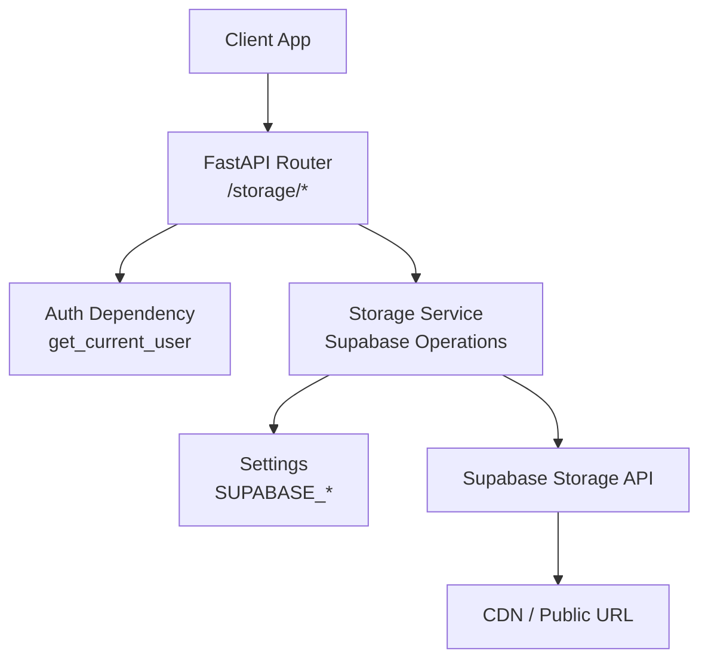
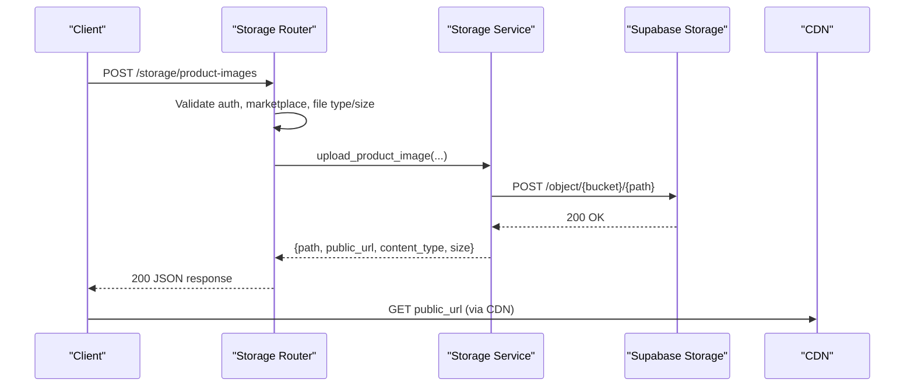
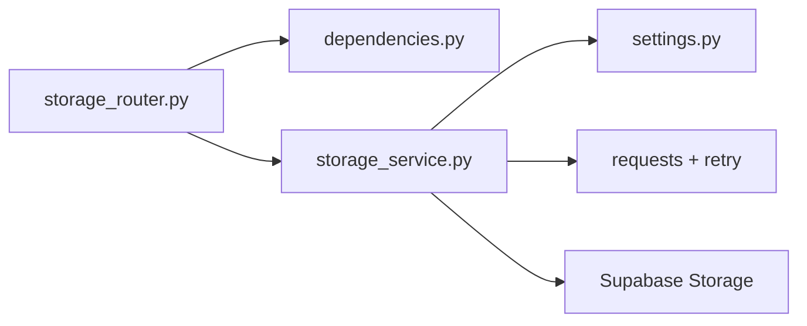

# Storage Management

<cite>
**Referenced Files in This Document**
- [main.py](file://neurocom_backend/main.py)
- [storage_router.py](file://neurocom_backend/routers/storage_router.py)
- [storage_service.py](file://neurocom_backend/services/storage_service.py)
- [settings.py](file://neurocom_backend/utils/settings.py)
- [redis_cache.py](file://neurocom_backend/utils/redis_cache.py)
- [dependencies.py](file://neurocom_backend/dependencies.py)
- [security.py](file://neurocom_backend/utils/security.py)
- [daraz_router.py](file://neurocom_backend/routers/daraz_router.py)
</cite>

## Table of Contents
1. [Introduction](#introduction)
2. [Project Structure](#project-structure)
3. [Core Components](#core-components)
4. [Architecture Overview](#architecture-overview)
5. [Detailed Component Analysis](#detailed-component-analysis)
6. [Dependency Analysis](#dependency-analysis)
7. [Performance Considerations](#performance-considerations)
8. [Troubleshooting Guide](#troubleshooting-guide)
9. [Conclusion](#conclusion)
10. [Appendices](#appendices)

## Introduction
This document explains the storage management capabilities of the Tijarah AI Backend, focusing on file upload and download operations, image validation, cloud storage integration with Supabase, security policies, access control, CDN usage, caching strategies, performance optimization, metadata handling, cleanup procedures, and operational guidance for large files, batch operations, and monitoring.

The backend exposes a secure FastAPI router for marketplace product images, validates uploads, stores assets in a Supabase bucket, and returns public URLs suitable for CDN delivery. It also provides endpoints to clean up images and supports downloading objects via service credentials when needed.

## Project Structure
Storage-related functionality is organized into:
- API layer (FastAPI router) that defines endpoints and request/response models
- Service layer that implements Supabase Storage interactions, path generation, and validation
- Configuration via environment variables for Supabase connectivity
- Authentication and authorization dependencies ensuring only authenticated merchants can operate on their own data
- Caching utilities used elsewhere in the application (useful context for performance patterns)

**Diagram sources**
- [storage_router.py:1-65](file://neurocom_backend/routers/storage_router.py#L1-L65)
- [storage_service.py:1-142](file://neurocom_backend/services/storage_service.py#L1-L142)
- [settings.py:26-28](file://neurocom_backend/utils/settings.py#L26-L28)
- [main.py:78-87](file://neurocom_backend/main.py#L78-L87)

**Section sources**
- [main.py:78-87](file://neurocom_backend/main.py#L78-L87)
- [storage_router.py:1-65](file://neurocom_backend/routers/storage_router.py#L1-L65)
- [storage_service.py:1-142](file://neurocom_backend/services/storage_service.py#L1-L142)
- [settings.py:26-28](file://neurocom_backend/utils/settings.py#L26-L28)

## Core Components
- Storage Router: Defines endpoints for uploading and cleaning up marketplace product images, enforcing authentication and marketplace connection checks.
- Storage Service: Implements Supabase Storage operations including upload, download, parsing object paths from URLs, and bulk deletion with merchant-scoped validation.
- Settings: Provides Supabase configuration values loaded from environment variables.
- Dependencies: Enforces JWT-based authentication and ensures requests are scoped to an authenticated merchant.
- Security Utilities: Provide token creation/decoding and encryption helpers used across the app.

Key responsibilities:
- Validate file type and size before upload
- Generate safe, unique filenames and structured paths per merchant and marketplace
- Upload to Supabase using service credentials and return public URLs
- Support private downloads via service role key
- Enforce ownership constraints during deletion
- Centralize error handling and retry behavior for network calls

**Section sources**
- [storage_router.py:1-65](file://neurocom_backend/routers/storage_router.py#L1-L65)
- [storage_service.py:1-142](file://neurocom_backend/services/storage_service.py#L1-L142)
- [settings.py:26-28](file://neurocom_backend/utils/settings.py#L26-L28)
- [dependencies.py:17-43](file://neurocom_backend/dependencies.py#L17-L43)
- [security.py:22-28](file://neurocom_backend/utils/security.py#L22-L28)

## Architecture Overview
The storage architecture follows a layered approach:
- The FastAPI router handles HTTP requests, validates inputs, and enforces authentication.
- The service layer encapsulates all Supabase Storage interactions, including retries, timeouts, and error mapping.
- Environment-driven settings configure the Supabase endpoint, secret key, and bucket name.
- Public URLs returned by the service are intended for CDN delivery; the backend does not proxy media through itself unless explicitly requested via a download endpoint.

**Diagram sources**
- [storage_router.py:46-59](file://neurocom_backend/routers/storage_router.py#L46-L59)
- [storage_service.py:46-74](file://neurocom_backend/services/storage_service.py#L46-L74)

**Section sources**
- [storage_router.py:46-59](file://neurocom_backend/routers/storage_router.py#L46-L59)
- [storage_service.py:46-74](file://neurocom_backend/services/storage_service.py#L46-L74)

## Detailed Component Analysis

### Storage Router
Responsibilities:
- Define endpoints under /storage for product image upload and cleanup
- Enforce marketplace connection requirements before allowing uploads
- Validate content type against allowed types and enforce maximum file size
- Verify image signatures to prevent spoofed content types
- Return standardized responses with path, public URL, content type, and size

Security considerations:
- Requires authenticated merchant via dependency injection
- Validates marketplace connection state
- Rejects unsupported or invalid image content

Endpoints:
- POST /storage/product-images: Uploads a product image for a specified marketplace
- POST /storage/product-images/cleanup: Deletes multiple images by path

Error handling:
- Returns appropriate HTTP status codes for unsupported types, empty files, oversized files, invalid signatures, and missing marketplace connections

**Section sources**
- [storage_router.py:17-65](file://neurocom_backend/routers/storage_router.py#L17-L65)

### Storage Service
Responsibilities:
- Configure Supabase connectivity and validate required settings
- Generate safe filenames and structured paths per merchant and marketplace
- Upload images to Supabase with retries and timeouts
- Construct public URLs for CDN delivery
- Download images using service credentials for private buckets
- Parse object paths from Supabase URLs
- Delete images in bulk while enforcing merchant ownership

Data structures and algorithms:
- Filename sanitization removes unsafe characters and limits length
- Path construction includes merchant ID, marketplace slug, timestamp, UUID, and sanitized filename
- Retry strategy uses exponential backoff for POST and DELETE operations

Security and validation:
- Validates paths to prevent directory traversal
- Ensures delete operations only target paths owned by the authenticated merchant
- Enforces HTTPS for public URLs

Error handling:
- Maps network errors and non-OK responses to consistent HTTP exceptions
- Logs detailed information for upload failures

**Section sources**
- [storage_service.py:1-142](file://neurocom_backend/services/storage_service.py#L1-L142)

### Authentication and Access Control
- All storage endpoints require a valid JWT bearer token identifying an authenticated merchant
- The dependency resolves the merchant from the token and database, rejecting unauthorized or malformed tokens
- Marketplace-specific operations additionally verify an active connection for the requested marketplace

Access control mechanisms:
- Merchant-scoped paths ensure isolation between tenants
- Deletion endpoints enforce ownership by validating path prefixes match the current merchant

**Section sources**
- [dependencies.py:17-43](file://neurocom_backend/dependencies.py#L17-L43)
- [storage_router.py:32-36](file://neurocom_backend/routers/storage_router.py#L32-L36)
- [storage_service.py:128-134](file://neurocom_backend/services/storage_service.py#L128-L134)

### File Validation and Image Optimization
Validation:
- Allowed content types: JPEG, PNG, WebP
- Maximum file size enforced at the router level
- Signature verification ensures actual file content matches declared content type

Optimization:
- No server-side image resizing or compression is implemented in this codebase
- Filenames are sanitized and normalized to safe forms
- Paths include timestamps and UUIDs to avoid collisions and aid deduplication

Recommendations:
- Integrate client-side image optimization (resize, compress) before upload to reduce bandwidth and storage costs
- Consider adding server-side processing if dynamic resizing is required

**Section sources**
- [storage_router.py:49-58](file://neurocom_backend/routers/storage_router.py#L49-L58)
- [storage_service.py:38-43](file://neurocom_backend/services/storage_service.py#L38-L43)

### Cloud Storage Integration with Supabase
Integration details:
- Uses Supabase Storage v1 REST API
- Authenticates with service role key for both uploads and downloads
- Stores images in a configured bucket with merchant-scoped paths
- Returns public URLs constructed for CDN consumption

Configuration:
- SUPABASE_URL, SUPABASE_SECRET_KEY, SUPABASE_PRODUCT_BUCKET loaded from environment
- Missing configuration results in a service unavailable response

Operational notes:
- Network errors are retried with a bounded retry policy
- Timeouts protect against hanging requests

**Section sources**
- [storage_service.py:19-35](file://neurocom_backend/services/storage_service.py#L19-L35)
- [storage_service.py:46-74](file://neurocom_backend/services/storage_service.py#L46-L74)
- [settings.py:26-28](file://neurocom_backend/utils/settings.py#L26-L28)

### CDN Integration and Caching Strategies
CDN usage:
- Public URLs point to Supabase’s public object endpoint, which can be served via CDN
- Ensure your CDN is configured to cache these URLs appropriately

Caching strategies:
- The application includes a Redis-backed cache utility for other features (cache-aside with background stale-while-revalidate)
- For media assets, rely on CDN caching headers and browser caching; consider versioning URLs (e.g., query strings or unique filenames) to bust caches when necessary

Best practices:
- Use immutable filenames (already included via timestamp + UUID) to enable long-lived CDN caching
- Set appropriate Cache-Control headers at the CDN or Supabase level if supported

**Section sources**
- [redis_cache.py:1-31](file://neurocom_backend/utils/redis_cache.py#L1-L31)
- [redis_cache.py:152-203](file://neurocom_backend/utils/redis_cache.py#L152-L203)

### File Metadata Management
Metadata captured and returned:
- Path: internal object path within the bucket
- Public URL: CDN-ready URL for clients
- Content Type: validated MIME type
- Size: uploaded file size in bytes

Usage:
- Store these fields in your application’s database alongside product records to reference images efficiently

**Section sources**
- [storage_service.py:46-74](file://neurocom_backend/services/storage_service.py#L46-L74)

### Cleanup Procedures
Cleanup endpoint:
- Accepts a list of object paths to delete
- Validates that each path belongs to the authenticated merchant
- Performs bulk deletion via Supabase prefix-based delete

Operational guidance:
- Use cleanup after product updates or deletions to remove orphaned images
- Batch deletions reduce API calls and improve efficiency

**Section sources**
- [storage_router.py:62-65](file://neurocom_backend/routers/storage_router.py#L62-L65)
- [storage_service.py:128-141](file://neurocom_backend/services/storage_service.py#L128-L141)

### Storage Quota Enforcement
Current implementation:
- No explicit quota enforcement logic is present in the codebase
- Quotas should be managed at the Supabase project level or via external monitoring/alerting

Recommendations:
- Monitor bucket usage and set alerts in Supabase dashboard
- Implement application-level checks if you need hard limits per merchant

[No sources needed since this section provides general guidance]

### Handling Large Files and Batch Operations
Large files:
- Maximum upload size is enforced at 5 MB per image
- For larger assets, consider chunked uploads or alternative storage strategies outside this module

Batch operations:
- Bulk deletion endpoint supports multiple paths in one request
- Avoid excessive concurrent uploads to prevent rate limiting; use client-side queuing if necessary

**Section sources**
- [storage_router.py:52-56](file://neurocom_backend/routers/storage_router.py#L52-L56)
- [storage_service.py:128-141](file://neurocom_backend/services/storage_service.py#L128-L141)

### Storage Monitoring
Monitoring recommendations:
- Track upload/download success rates and error codes
- Log Supabase connectivity issues and response statuses
- Set up alerts for repeated failures or high latency

Operational visibility:
- The service logs upload connection failures with contextual details
- Use application metrics to monitor endpoint latency and throughput

**Section sources**
- [storage_service.py:58-68](file://neurocom_backend/services/storage_service.py#L58-L68)

## Dependency Analysis
The storage subsystem depends on:
- FastAPI router for HTTP handling
- Authentication dependency for merchant scoping
- Settings for Supabase configuration
- Requests library with retry adapter for resilient network calls
- Optional Redis cache utility for other features (not directly used by storage but illustrative of caching patterns)

**Diagram sources**
- [storage_router.py:1-65](file://neurocom_backend/routers/storage_router.py#L1-L65)
- [storage_service.py:1-142](file://neurocom_backend/services/storage_service.py#L1-L142)
- [settings.py:26-28](file://neurocom_backend/utils/settings.py#L26-L28)
- [dependencies.py:17-43](file://neurocom_backend/dependencies.py#L17-L43)

**Section sources**
- [storage_router.py:1-65](file://neurocom_backend/routers/storage_router.py#L1-L65)
- [storage_service.py:1-142](file://neurocom_backend/services/storage_service.py#L1-L142)
- [settings.py:26-28](file://neurocom_backend/utils/settings.py#L26-L28)
- [dependencies.py:17-43](file://neurocom_backend/dependencies.py#L17-L43)

## Performance Considerations
- Connection pooling and retries: The service configures a requests session with retry logic and connection pooling to improve resilience and throughput.
- Timeouts: Upload and download operations specify connect and read timeouts to prevent indefinite hangs.
- CDN caching: Leverage CDN caching for public URLs; immutable filenames enable long cache lifetimes.
- Client-side optimization: Compress and resize images before upload to reduce bandwidth and storage costs.
- Batch deletions: Use the cleanup endpoint to minimize API calls when removing multiple assets.

[No sources needed since this section provides general guidance]

## Troubleshooting Guide
Common issues and resolutions:
- Unsupported image type: Ensure the client sends a supported MIME type (JPEG, PNG, WebP).
- Empty file: Verify the client reads and sends the file content correctly.
- Oversized file: Enforce a 5 MB limit on the client side to avoid rejection.
- Invalid image signature: Confirm the file content matches the declared content type.
- Missing marketplace connection: Ensure the merchant has an active connection for the requested marketplace.
- Supabase not configured: Check environment variables for SUPABASE_URL and SUPABASE_SECRET_KEY.
- Network errors: Inspect logs for connection failures; retries are applied for POST and DELETE.
- Ownership violation on delete: Ensure paths start with the authenticated merchant’s ID.

**Section sources**
- [storage_router.py:49-58](file://neurocom_backend/routers/storage_router.py#L49-L58)
- [storage_router.py:32-36](file://neurocom_backend/routers/storage_router.py#L32-L36)
- [storage_service.py:32-35](file://neurocom_backend/services/storage_service.py#L32-L35)
- [storage_service.py:58-74](file://neurocom_backend/services/storage_service.py#L58-L74)
- [storage_service.py:128-141](file://neurocom_backend/services/storage_service.py#L128-L141)

## Conclusion
The Tijarah AI Backend provides a robust, secure, and efficient storage management system for marketplace product images. It integrates with Supabase Storage, enforces strict validation and access controls, and returns CDN-ready URLs. While no server-side image optimization is implemented, the design supports client-side optimization and CDN caching for performance. Operational best practices include monitoring, quota management at the platform level, and leveraging batch operations for cleanup.

[No sources needed since this section summarizes without analyzing specific files]

## Appendices

### API Endpoints Summary
- POST /storage/product-images
  - Purpose: Upload a product image for a specified marketplace
  - Requirements: Authenticated merchant, active marketplace connection, supported image type and size
  - Response: Object path, public URL, content type, size

- POST /storage/product-images/cleanup
  - Purpose: Delete multiple images by path
  - Requirements: Authenticated merchant, paths must belong to the merchant
  - Response: List of deleted paths

**Section sources**
- [storage_router.py:46-65](file://neurocom_backend/routers/storage_router.py#L46-L65)

### Environment Variables
- SUPABASE_URL: Base URL for Supabase Storage
- SUPABASE_SECRET_KEY: Service role key for authenticated operations
- SUPABASE_PRODUCT_BUCKET: Bucket name for product images

**Section sources**
- [settings.py:26-28](file://neurocom_backend/utils/settings.py#L26-L28)

### Related Integrations
- Daraz image migration uses storage paths and URLs, demonstrating how stored assets integrate with marketplace publishing workflows.

**Section sources**
- [daraz_router.py:176-204](file://neurocom_backend/routers/daraz_router.py#L176-L204)